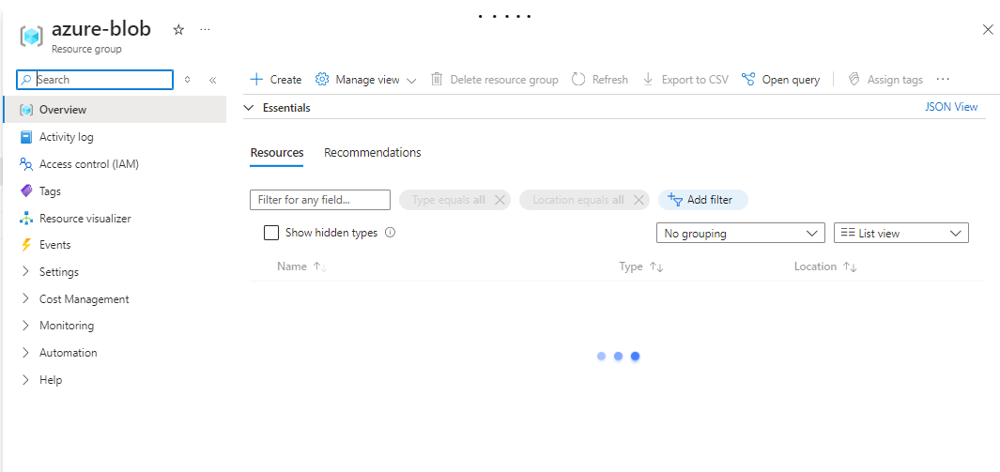
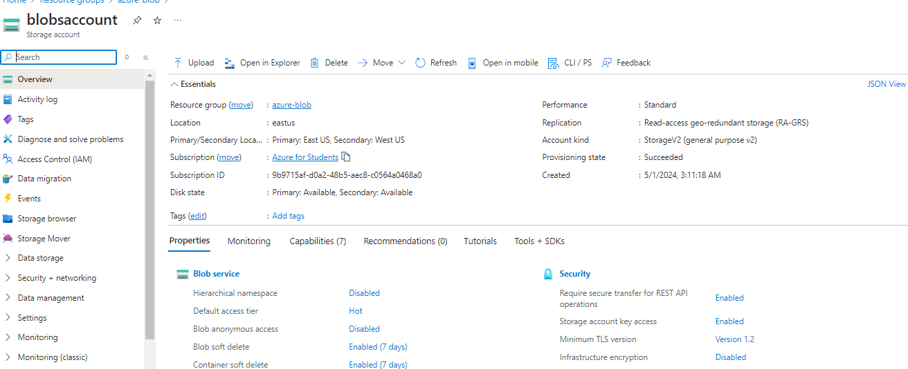
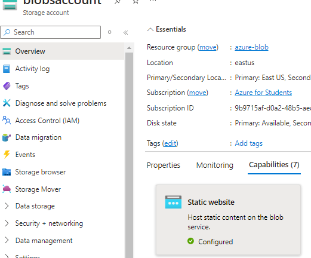
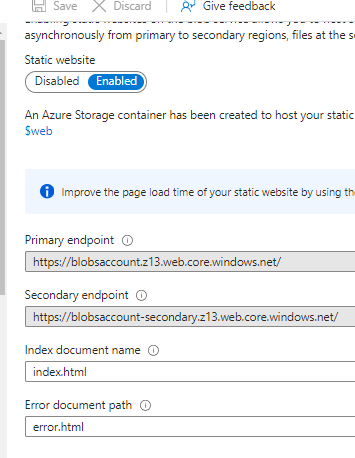

# azure-blobstorage

Azure Blob storage is designed for serving images or documents directly to the browser. It provides scalable, cost-efficient object storage in the cloud. 

## What is Blob? - 
Any type of data can go into a blob. Blob- A binary Large object is a collection of data of an arbitrary size; It can be complex files like images, can be read as text and array buffers.

A Blob storage is simply a stroge service for saving blob objects 

Azure blob storage provides other capabilites which we can call standalone services they are gotten from combination of servieces 
- Static Website : Host static content on the blob service.
- Data Protection: Save and recover data when it is erroneously modified or deleted 
- LifeCycle management: Create rule-based polices for storage accounts 
- Front Door and CDN Profiles: Serve file faster and more reliably
- Custom Domain: Configure a custom domain for accessing blob data 
- Security: Enable  Azure Defender for your storage account
- Private Endpoints: Secure data access over  a private link

## Deploy a Static Web Site With Azure Blob Storage

- Create a new resource group

- Create a storage account in the resource group

- Go to the storage account resource. In the Overiew page click on on the capabilities tab

- Click on the static website capability 
- Add your entry file and error file name. Then save it.

- After saving it a primary and secondary endpoint is created for you automatically 
- Now go to the storage browser page
[!Storage Browser](./images/storage-browser.png)
- Click the Blob containers tab and enter the $web container
[!Blob contiaber](./images/blob-container.png)
- Upload your static files to this filder
[!Hosted web files](./images/hosted-webfiles.png)
- Now go to the url generated for you  
- In my case it is - https://blobsaccount.z13.web.core.windows.net/